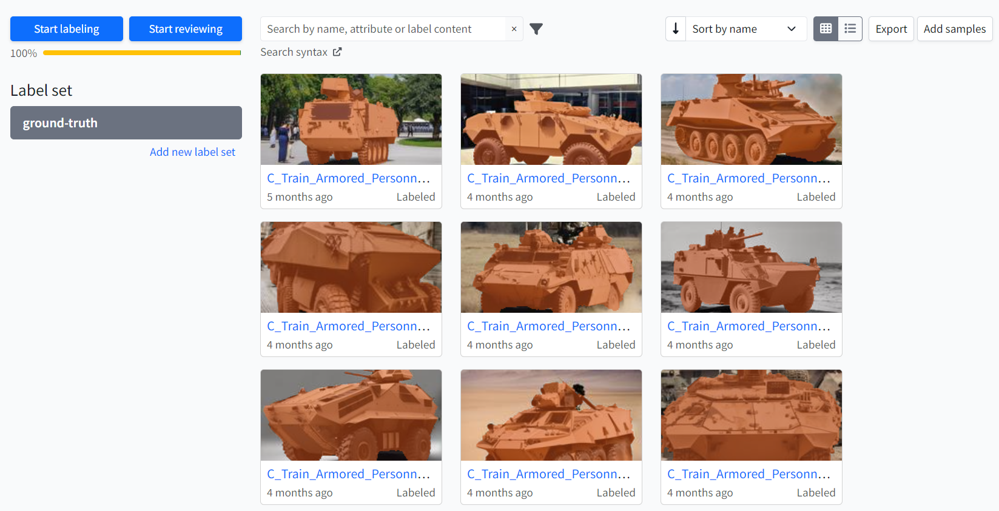

# Object Detection and Scene Recognition Dataset Generation

This repository contains example code for generating images for object detection and scene recognition tasks. The dataset includes images of various vehicle categories produced using **Stable Diffusion** by StabilityAI via the **HuggingFace** platform. It was created to facilitate and enhance research and development in object detection and scene recognition models.

## Dataset Details

The generated images include the following vehicle categories:

- Armored Personnel Carrier
- Bulldozer
- Cement Mixer Truck
- Dump Truck
- Passenger Airplane
- Fighter Jet
- Microcar
- Military Helicopter
- Military Tank
- Military Truck
- Motorcycle
- Pickup Truck
- Transport/Rescue Helicopter
- Sedan Car
- SUV
- Sport Car

## Image Generation Process

Images were generated using **Stable Diffusion** from StabilityAI through HuggingFace, ensuring high-quality and diverse samples for each category. 

## Ground Truth Annotation

To create a reliable and annotated dataset, we used **segments.ai** to segment and label each image. This process ensures that every image has accurate annotations, providing a robust ground truth dataset for training and evaluation purposes.

## Why Use Generated Images?

Typically, object detection and scene recognition datasets are made using real-world images. However, collecting real images can be time-consuming, expensive, and sometimes impractical—especially for specific or rare categories. 

We can rapidly generate large quantities of diverse and high-quality training data by creating images using models like Stable Diffusion. This method is especially beneficial when: 
- Obtaining real images is challenging due to access or safety issues. 
- We require a well-rounded dataset encompassing various angles, lighting conditions, and environments for consistent model training. 
- Our goal is to enhance existing datasets, ensuring that models generalize better by exposing them to a broader range of samples. 

Therefore, utilizing generated images as a training dataset supplements real-world data and offers a scalable solution for efficiently expanding and diversifying our training data.

## Sample Dataset

Below are some samples from the final dataset. Each image is segmented and labeled to provide clear, structured data for object detection and scene recognition models.

